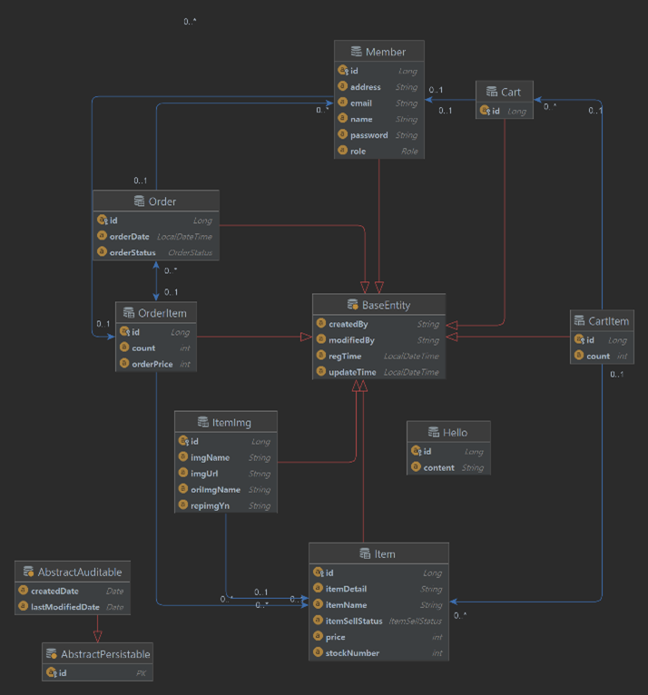

# 프로젝트 개요
. Spring Boot 를 활용한 미니 쇼핑몰 

---
# 개발기간
. 2022.05 ~ 2022.06

---
## 기술 스택

1. **Spring Boot** 
2. **Spring Web MVC**
3. **JPA** 
3. **JUnit** 
4. **Spring Security**
5. **MYSQL**
---

## 개발 도구

1. **IntelliJ** 

---
### 구현기능

1. 회원가입, 로그인 / 로그아웃
2. 상품 등록 / 상품 관리 / 상품 조회
3. 주문 / 주문 이력 확인 / 주문 취소
4. 장바구니 담기 / 장바구니 관리 / 장바구니를 기반으로 주문하기

---

## ER 다이어그램

---

## UI 디자인

### 메인페이지

### 로그인 페이지

### 회원가입 페이지

### 물품 주문 상세 페이지

### 상품 등록 페이지

### 상품 관리 페이지 

### 장바구니 페이지 

### 구매이력 페이지

---